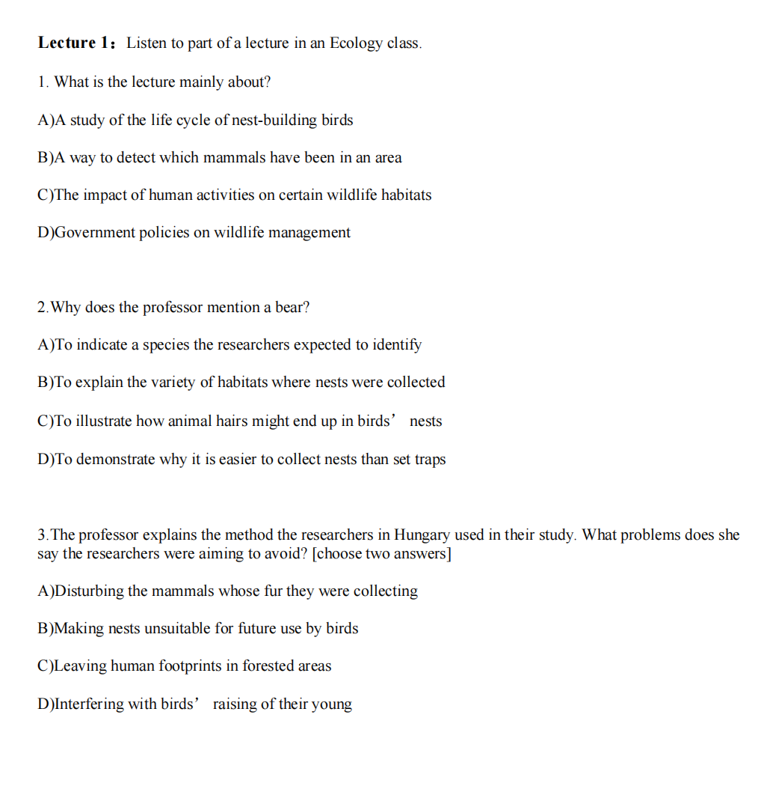
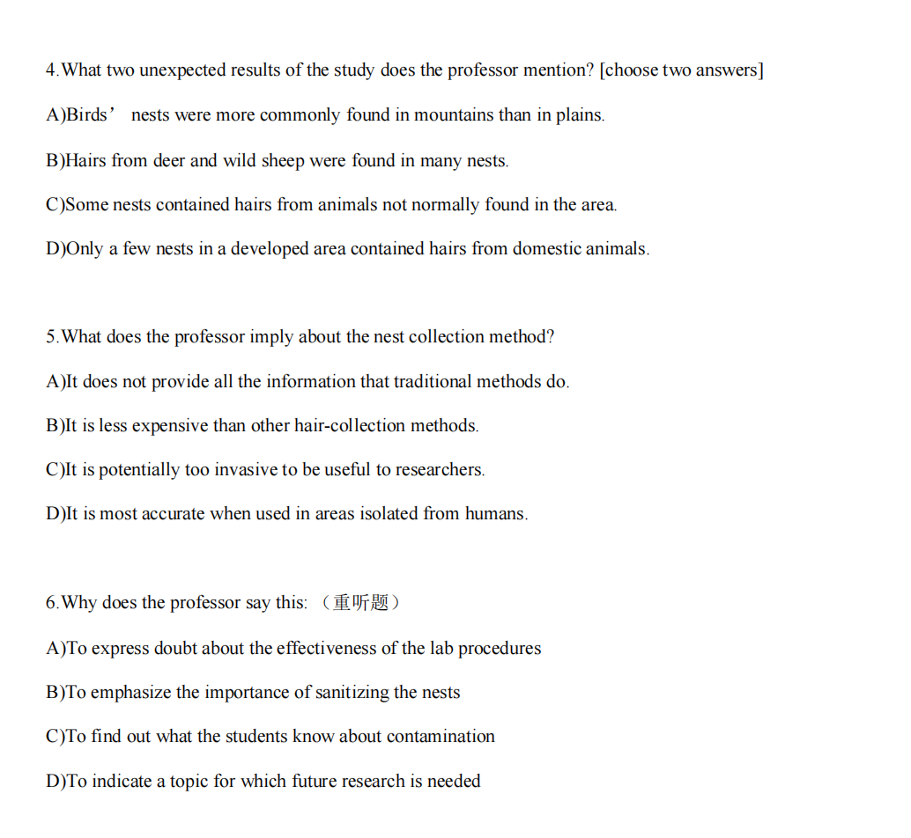
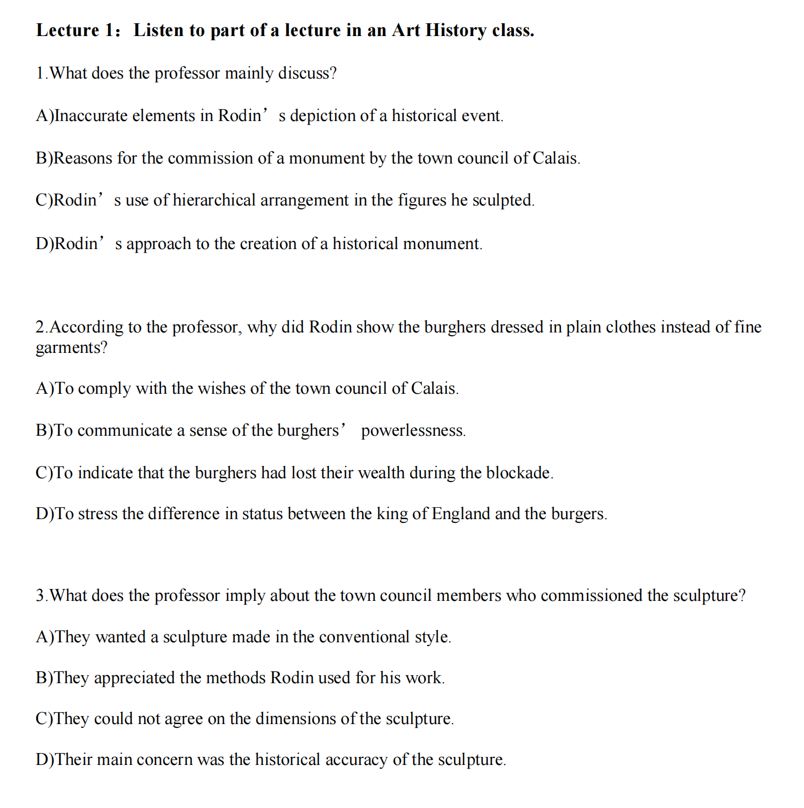
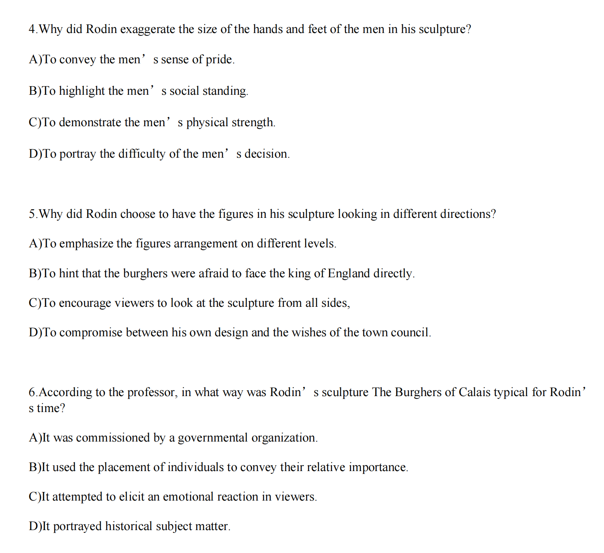

### Lecture Ecology

<audio src="./音频/S1L1.mp3"></audio>

<audio src="./音频/S1L1重听题.mp3"></audio>

### Lecture Biology fossil records

<audio src="./音频/S1L1(1).mp3"></audio>

### Lecture magnetize

<audio src="./音频/S1L2.mp3"></audio>

### Lecture ArtHistory

<audio src="./音频/arthistory.mp3"></audio>

