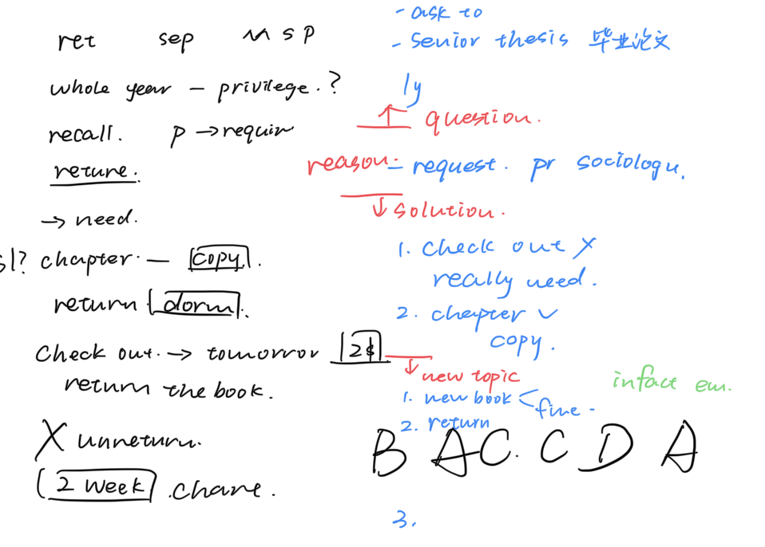

# Listening

## 关键词句

Cool. Anyway, um, the reason I came by is...

## criteria
### Office hour conversation
* take place in a professor’s office
* Related with course requirements
### Service encounter conversation
* campus
* Non-academic content

### Academic topics
* Arts
* Life science
    * prehistoric 
* Physical science
* Social science
  Anthropology
  Astronomy
  History
  Psychology

## Conversation

#### basic comprehension question
1. Gist-content（主旨内容)
2. Gist-purpose（主旨目的)
3. Detail
#### pragmatic understanding questions
4. Understanding the function of what is said(给一段之前听过的音频）
5. Understanding the speaker’s attitude
#### Connecting information questions
6. Understanding organization（可能与话题主旨无关）
7. Connecting content（逻辑联系词）
8. Making inferences（推断题）
	同义替换

### Service Encounter
* Problem
* Reason
* Solution
* Response
  | S                      | O                                                 |
  | ---------------------- | ------------------------------------------------- |
  | purpose: the thing is… |                                                   |
  | reason                 | reason(main): officer help to find out the reason |
  |                        | solution                                          |
  | response               |                                                   |
  Attitude
  Advice what to do next
  New topic

### library

Overdue 
Journal issue期刊杂志，日志
 Renew 续借
Reference section参考资料区
Abstract 
Reserve 预留
Loan counter 借书处
Loan period 图书借阅期
check out借书
photocopier 
index 主页，索引
refund 退款
interlibrary loan service 馆际借阅
database数据库
glove 手套
annual book sale 

Extended borrowing privileges 额外借书特权
thesis 论文
senior thesis毕业论文


Encyclopedia 百科全书
drop off box 

### parking lot
Ticket  write sb a ticket 收到罚单
plate number 车牌号
driver’s license
DUI (drive under the influence)喝醉了
Get drunk 
Get wasted 酩酊大醉
Get buzzed 


Parking tag 停车证
安心 reassure
The parking tag won’t do you much good. =expire到期，过期
Technician 技术人员
odds 几率，概率
double negations 
Grant 拨款
grand total 总数
The chances of him passing the math exam are good.
He’s got a good chance of passing the math exam.

### accommodation
housing booklet 小册子
File a complaint 抱怨，投诉
work progress
Get stuck with a small room
Spacious 空旷的
roomy 空旷的
current 
eligible = qualified
Have no bearing 支撑物，依据
there is an explicit rule
Implicit 不明确的
Spell it out 拼写出来了，很清晰
rotate 轮转，轮换
Let your RA mediate for you.
Resort to 诉诸于
We won’t resort it to that.
Flown the rule 炫耀这个选项，服从规定
Reimburse 补偿reimburse you for 
I will flow the idea about what you said.

## Lecture

imply 态度题

专有名词

* limitation
* complication
* inconsistency
* glitch

hypothesis 

引入信息题

### Art History

topic

intro- age, story

* style
* Artist (similarity/difference)
* artworks - techniques - function

## 逻辑词

#### 主题

* now, let's talk about several points about...
* we're going to talk about...
* For today, let's look at...
* Anyway, let's focus on...

 

#### 并列

* Ns（名词复数）N引出并列N的变化（如reason变成 factor because of)
* one, first, firstly
* another、also、 next、 and、 several、some(不重读，重读是引出转折）、a variety of、Many

* plus, besides, in addition, on top of, furthermore, there's more to it, aside from

 

#### 转折

* However、 but 、 although、 though、 whereas、nevertheless
* 最开始类：traditionally、initially、 originally、in the beginning. at first
* 过去类：Used to、thought、 believed 、 it was thought, it was believed
* 频率类：Usually、generally、frequently、
* 部分类：some、most 、many、a lot of
* 当然类：of course、certainly、sure
* 声称类：claim、speculate、hypothesize

####  **例子**

* For example, for instance, take... for instance, like, take, say, consider, imagine

#### **比较对比**

* Distinguish, differentiate, compare, contrast, like, unlike, analogue, analogous

#### **概念与解释推论**

* Means, called, named,known as, refer to, is
* I mean, you see, which means, it suggests, implies, indicates

 

#### **强调**

##### Adj.

* Interesting , important , surprising, strange, fascinating, remarkable, intriguing, unusual, particular

##### none

* Key, the point, the thing

##### V.

* Stress, emphasize, notice, remember, keep in mind

 

#### **表达存在问题**

problem, complication, limitation, puzzling, baffling, confounding, confusing

 

#### **因果**

* Reason, factor, due to, because, because of, be caused by, cause, so, as a result, consequently...

 

#### **态度（+-/×)**

* 最简单的是 in my opinion, I think...
* 很多时候出现句子或一些动词形容词来表示态度，比如 we need more evidence, only time will tell, it's hard to tell, speak out against it, reject, embrace...

#### agree

consensus 共识

-------

#### negative

irrefutable

---------

identical

analogue

contend

